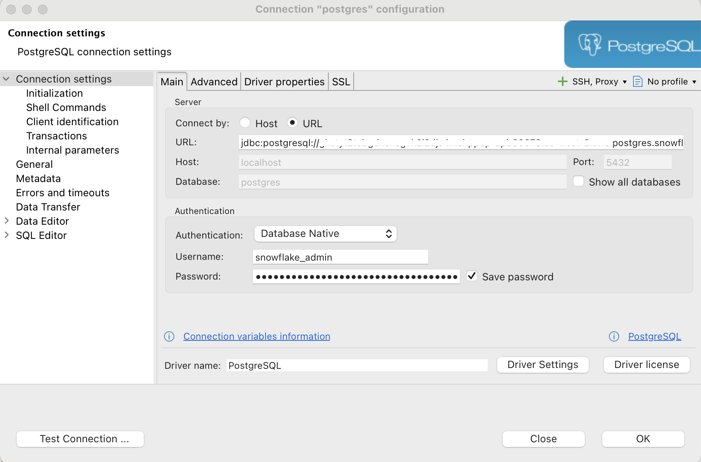
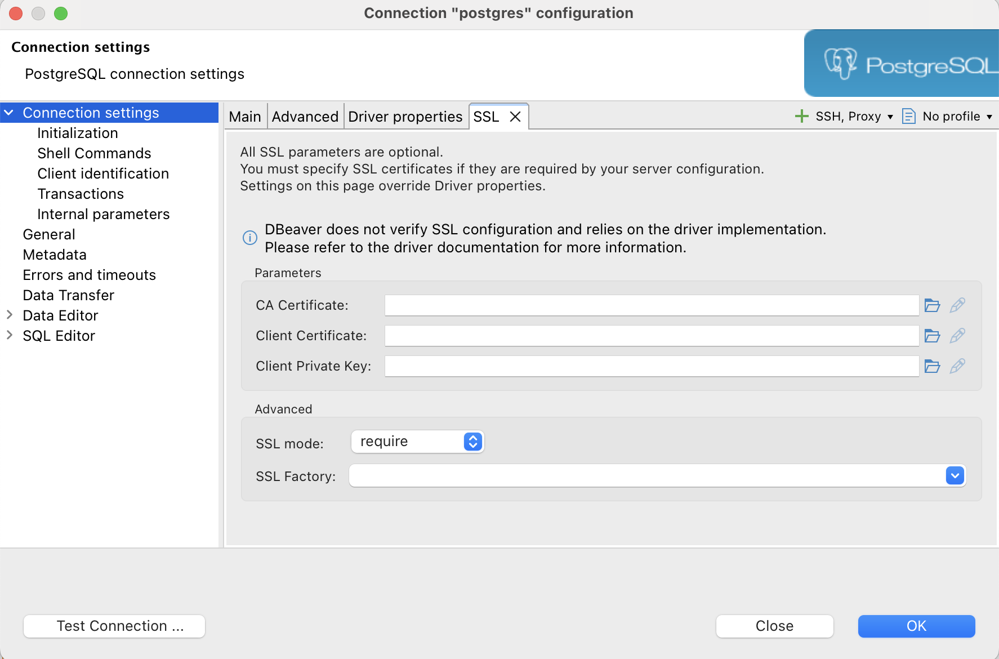

# Getting Started with Snowflake Postgres

## Introduction

This guide will walk you through creating and connecting to a Postgres instance within Snowflake. Snowflake Postgres allows you to run PostgreSQL workloads directly within your Snowflake environment, providing seamless integration with your data cloud infrastructure.

## Prerequisites

- Active Snowflake account with appropriate privileges
- DBeaver or another SQL client installed on your local machine
- Your public IP address (find it at https://whatismyipaddress.com/)

## Table of Contents

1. [Creating a Postgres Instance](#1-creating-a-postgres-instance)
2. [Setting Up Network Rules and Policies](#2-setting-up-network-rules-and-policies)
3. [Checking Instance Status and Credentials](#3-checking-instance-status-and-credentials)
4. [Connecting from DBeaver](#4-connecting-from-dbeaver)
5. [Sample Database Setup](#5-sample-database-setup)
6. [Cost Management](#6-cost-management)

---

## 1. Creating a Postgres Instance

### Option A: Using SQL
```sql
CREATE POSTGRES INSTANCE "DEV-POSTGRES-INTRODUCTION"
  COMPUTE_FAMILY = 'STANDARD_M'
  STORAGE_SIZE_GB = 10
  AUTHENTICATION_AUTHORITY = POSTGRES
  POSTGRES_VERSION = 18 
  HIGH_AVAILABILITY = FALSE 
  COMMENT = 'First instance for "Getting started with Snowflake postgres"';
```

**Important Note:** Snowflake doesn't support hyphens in instance names by default. Use double quotes to preserve hyphens, or use underscores instead (e.g., `DEV_POSTGRES_INTRODUCTION`).

#### Configuration Parameters Explained

| Parameter | Description | Options | Recommendation |
|-----------|-------------|---------|----------------|
| `COMPUTE_FAMILY` | Compute resources allocated to the instance | `STANDARD_S`, `STANDARD_M`, `STANDARD_L`, `STANDARD_XL` | Start with `STANDARD_M` for development |
| `STORAGE_SIZE_GB` | Storage capacity in gigabytes | Minimum: 10 GB | Start with 10 GB, increase as needed |
| `AUTHENTICATION_AUTHORITY` | Authentication method | `POSTGRES`, `SNOWFLAKE` | Use `POSTGRES` for standard PostgreSQL authentication |
| `POSTGRES_VERSION` | PostgreSQL version | `15`, `16`, `17`, `18` | Use latest stable version (18) |
| `HIGH_AVAILABILITY` | Enable failover replica | `TRUE`, `FALSE` | Use `FALSE` for development to save costs |
| `NETWORK_POLICY` | Network access policy | Policy name | Set after creating network rules |
| `POSTGRES_SETTINGS` | Custom PostgreSQL settings | JSON string | Optional, see [documentation](https://docs.snowflake.com/en/user-guide/snowflake-postgres/postgres-server-settings) |

#### Pricing Information

**Compute Costs:**
- `STANDARD_M`: ~0.0356 credits/hour (~26 credits/month ~24/7 = ~$100 USD/month)
- View full pricing: [Snowflake Credit Consumption Table](https://www.snowflake.com/legal-files/CreditConsumptionTable.pdf)

**Storage Costs:**
- ~$130 USD/TB/month
- 10 GB = ~$1.30/month

For detailed pricing, visit: [Snowflake Pricing](https://www.snowflake.com/pricing/)

### Option B: Using Snowflake UI

[PLACEHOLDER: Screenshot of Snowflake UI navigation]

1. Navigate to **Data** → **Databases** → **+ Database**
2. Select **Postgres Instance**
3. Fill in the configuration form:
   - Instance Name
   - Compute Family
   - Storage Size
   - Postgres Version
   - High Availability
4. Click **Create**

[PLACEHOLDER: Screenshot of Postgres instance creation form]

---

## 2. Setting Up Network Rules and Policies

To connect from your local machine, you need to configure network rules that allow ingress (incoming) traffic from your IP address.

**Documentation:** [Snowflake Postgres Network Configuration](https://docs.snowflake.com/en/user-guide/snowflake-postgres/postgres-network)

### Understanding Network Traffic

- **INGRESS (Inbound)**: Traffic coming INTO your Postgres instance (e.g., SQL client connecting to Postgres)
- **EGRESS (Outbound)**: Traffic going OUT FROM your Postgres instance (e.g., Postgres connecting to external APIs)

For local SQL client connections, you need **INGRESS** rules.

### SQL Setup
```sql
-- Step 1: Create a database for network policies
CREATE DATABASE NETWORK_CONFIG;

-- Step 2: Create the ingress rule
-- Replace '193.179.119.36' with your actual IP address
CREATE NETWORK RULE NETWORK_CONFIG.PUBLIC.PG_INGRESS_FROM_LOCAL
  TYPE = IPV4
  VALUE_LIST = ('193.179.119.36/32')
  MODE = POSTGRES_INGRESS;

-- Step 3: Create the network policy using the rule
CREATE NETWORK POLICY MY_LOCAL_ACCESS_POLICY
  ALLOWED_NETWORK_RULE_LIST = ('NETWORK_CONFIG.PUBLIC.PG_INGRESS_FROM_LOCAL')
  COMMENT = 'Allow access from my local machine';

-- Step 4: Apply the policy to your Postgres instance
ALTER POSTGRES INSTANCE "DEV-POSTGRES-INTRODUCTION"
  SET NETWORK_POLICY = 'MY_LOCAL_ACCESS_POLICY';
```

**Note:** The `/32` suffix means exactly one IP address. If your IP changes frequently, consider:
- Using a broader range (e.g., `/24`)
- Adding multiple IPs: `VALUE_LIST = ('IP1/32', 'IP2/32')`
- Setting up VPN with static IP

### UI Setup

[PLACEHOLDER: Screenshot of network policy creation in UI]

1. Navigate to **Admin** → **Security** → **Network Policies**
2. Click **+ Network Policy**
3. Configure ingress rules
4. Apply to Postgres instance

[PLACEHOLDER: Screenshot of applying network policy to instance]

---

## 3. Checking Instance Status and Credentials

### Verifying Instance Status

#### Using SQL
```sql
-- View all Postgres instances
SHOW POSTGRES INSTANCES;

-- Detailed instance information
SELECT 
  NAME,
  STATE,
  COMPUTE_FAMILY,
  STORAGE_SIZE_GB,
  HIGH_AVAILABILITY,
  CREATED
FROM SNOWFLAKE.INFORMATION_SCHEMA.POSTGRES_INSTANCES
WHERE NAME = 'DEV-POSTGRES-INTRODUCTION';
```

**Instance States:**
- `CREATING`: Instance is being provisioned (typically 2-5 minutes)
- `ACTIVE`: Instance is running and ready for connections
- `SUSPENDED`: Instance is stopped (no compute costs, storage costs continue)
- `FAILED`: Instance creation failed

#### Using UI

[PLACEHOLDER: Screenshot of SHOW POSTGRES INSTANCES output]

1. Navigate to **Data** → **Databases**
2. Find your Postgres instance
3. Check the status indicator

[PLACEHOLDER: Screenshot of Postgres instance in UI with status]

### Getting Connection Credentials

#### Using SQL
```sql
-- Describe the instance to get connection details
DESCRIBE POSTGRES INSTANCE "DEV-POSTGRES-INTRODUCTION";
```

This returns:
- **Connection URL**: Full postgres:// connection string
- **Admin Username**: Default `snowflake_admin`
- **Admin Password**: Auto-generated secure password
- **Host**: Hostname for JDBC/client connections
- **Port**: Always `5432`

#### Using UI

[PLACEHOLDER: Screenshot of instance details page]

1. Click on your Postgres instance
2. Navigate to **Connection Details** tab
3. Copy the connection information:
   - Host
   - Port
   - Admin Username
   - Admin Password (click "Show" to reveal)
   - Connection URL

[PLACEHOLDER: Screenshot of connection details with credentials highlighted]

### Managing Instance State
```sql
-- Start the instance
ALTER POSTGRES INSTANCE "DEV-POSTGRES-INTRODUCTION" RESUME;

-- Stop the instance (saves compute costs)
ALTER POSTGRES INSTANCE "DEV-POSTGRES-INTRODUCTION" SUSPEND;

-- Check status after operation
SELECT NAME, STATE 
FROM SNOWFLAKE.INFORMATION_SCHEMA.POSTGRES_INSTANCES
WHERE NAME = 'DEV-POSTGRES-INTRODUCTION';
```

**Cost Tip:** Always suspend your instance when not in use to minimize compute costs. Storage costs continue even when suspended.

---

## 4. Connecting from DBeaver

### Connection Setup

[PLACEHOLDER: Screenshot of DBeaver new connection dialog]

1. **Open DBeaver** and click **New Database Connection**
2. **Select PostgreSQL** (not Snowflake!) as the database type
3. **Fill in connection details**:

#### Connection Details

| Field | Value | Example |
|-------|-------|---------|
| **Host** | Your Postgres instance hostname | `abc123xyz.nchppep-zpb68379.us-west-2.aws.postgres.snowflake.app` |
| **Port** | `5432` | `5432` |
| **Database** | `postgres` | `postgres` (this is the default database inside the instance) |
| **Username** | `snowflake_admin` | `snowflake_admin` |
| **Password** | Auto-generated password from step 3 | `rWt2AkF4dr5Z9leg6gkljha0IR0XgSPf...` |



#### Understanding Database vs Instance

- **Postgres Instance** (Snowflake object): `DEV-POSTGRES-INTRODUCTION` - this is the Snowflake resource
- **Postgres Database** (inside instance): `postgres` - this is the default database you connect to
- Think of it as: Instance = Server, Database = Database within that server

### SSL Configuration



1. Navigate to **SSL** tab in connection settings
2. **Enable SSL**: Check "Use SSL"
3. **SSL Mode**: Select `require`
4. **DO NOT** enable "Verify server certificate" (unless you have root certificates configured)

#### SSL Settings Explained

| Setting | Recommended Value | Description |
|---------|------------------|-------------|
| Use SSL | ✓ Enabled | Encrypts connection traffic |
| SSL Mode | `require` | Enforces SSL without certificate verification |
| Verify Server Certificate | ✗ Disabled | Avoids certificate file requirement |

### JDBC URL Format (Alternative Method)

If you prefer to use a JDBC URL directly:
```
jdbc:postgresql://your-host.postgres.snowflake.app:5432/postgres?user=snowflake_admin&password=YOUR_PASSWORD&ssl=true&sslmode=require
```

Example:
```
jdbc:postgresql://abc123xyz.nchppep-zpb68379.us-west-2.aws.postgres.snowflake.app:5432/postgres?user=snowflake_admin&password=rWt2AkF4dr5Z9leg6gkljha0IR0XgSPf&ssl=true&sslmode=require
```

[PLACEHOLDER: Screenshot of successful DBeaver connection]

### Testing the Connection

1. Click **Test Connection** button
2. If prompted, download PostgreSQL JDBC drivers
3. Verify you see "Connected" message
4. Click **Finish** to save the connection

[PLACEHOLDER: Screenshot of successful connection test]

### Troubleshooting Common Issues

| Error | Solution |
|-------|----------|
| SSL certificate error | Set SSL mode to `require` and disable certificate verification |
| Connection timeout | Check network policy allows your IP address |
| Authentication failed | Verify username and password from instance details |
| Instance not found | Ensure instance is in `ACTIVE` state, not `SUSPENDED` |

---

## 5. Sample Database Setup

Now let's create a sample database with related tables to demonstrate the Postgres functionality.

### Creating the Data Model

This example creates a simple e-commerce data model with products, customers, orders, and order items.
```sql
-- =============================================
-- E-Commerce Sample Database
-- =============================================

-- Table 1: Customers
CREATE TABLE customers (
    customer_id SERIAL PRIMARY KEY,
    first_name VARCHAR(50) NOT NULL,
    last_name VARCHAR(50) NOT NULL,
    email VARCHAR(100) UNIQUE NOT NULL,
    phone VARCHAR(20),
    city VARCHAR(50),
    country VARCHAR(50),
    created_at TIMESTAMP DEFAULT CURRENT_TIMESTAMP
);

-- Table 2: Products
CREATE TABLE products (
    product_id SERIAL PRIMARY KEY,
    product_name VARCHAR(100) NOT NULL,
    category VARCHAR(50),
    price DECIMAL(10, 2) NOT NULL,
    stock_quantity INTEGER DEFAULT 0,
    description TEXT,
    created_at TIMESTAMP DEFAULT CURRENT_TIMESTAMP
);

-- Table 3: Orders
CREATE TABLE orders (
    order_id SERIAL PRIMARY KEY,
    customer_id INTEGER NOT NULL,
    order_date TIMESTAMP DEFAULT CURRENT_TIMESTAMP,
    status VARCHAR(20) DEFAULT 'pending',
    total_amount DECIMAL(10, 2),
    shipping_address TEXT,
    FOREIGN KEY (customer_id) REFERENCES customers(customer_id)
);

-- Table 4: Order Items
CREATE TABLE order_items (
    order_item_id SERIAL PRIMARY KEY,
    order_id INTEGER NOT NULL,
    product_id INTEGER NOT NULL,
    quantity INTEGER NOT NULL,
    unit_price DECIMAL(10, 2) NOT NULL,
    subtotal DECIMAL(10, 2) NOT NULL,
    FOREIGN KEY (order_id) REFERENCES orders(order_id),
    FOREIGN KEY (product_id) REFERENCES products(product_id)
);
```

### Inserting Sample Data
```sql
-- =============================================
-- Insert Sample Data
-- =============================================

-- Insert Customers (10 records)
INSERT INTO customers (first_name, last_name, email, phone, city, country) VALUES
('John', 'Smith', 'john.smith@email.com', '+1-555-0101', 'New York', 'USA'),
('Emma', 'Johnson', 'emma.j@email.com', '+1-555-0102', 'Los Angeles', 'USA'),
('Michael', 'Williams', 'michael.w@email.com', '+44-20-5501', 'London', 'UK'),
('Sophie', 'Brown', 'sophie.b@email.com', '+44-20-5502', 'Manchester', 'UK'),
('Hans', 'Mueller', 'hans.m@email.com', '+49-30-5501', 'Berlin', 'Germany'),
('Marie', 'Dubois', 'marie.d@email.com', '+33-1-5501', 'Paris', 'France'),
('Carlos', 'Garcia', 'carlos.g@email.com', '+34-91-5501', 'Madrid', 'Spain'),
('Anna', 'Kowalski', 'anna.k@email.com', '+48-22-5501', 'Warsaw', 'Poland'),
('Yuki', 'Tanaka', 'yuki.t@email.com', '+81-3-5501', 'Tokyo', 'Japan'),
('Sarah', 'Davis', 'sarah.d@email.com', '+1-555-0103', 'Chicago', 'USA');

-- Insert Products (15 records)
INSERT INTO products (product_name, category, price, stock_quantity, description) VALUES
('Laptop Pro 15"', 'Electronics', 1299.99, 50, 'High-performance laptop for professionals'),
('Wireless Mouse', 'Electronics', 29.99, 200, 'Ergonomic wireless mouse'),
('USB-C Hub', 'Electronics', 49.99, 150, '7-in-1 USB-C hub with multiple ports'),
('Desk Chair Pro', 'Furniture', 349.99, 30, 'Ergonomic office chair with lumbar support'),
('Standing Desk', 'Furniture', 599.99, 20, 'Adjustable height standing desk'),
('Notebook Set', 'Stationery', 15.99, 500, 'Set of 3 premium notebooks'),
('Pen Collection', 'Stationery', 24.99, 300, 'Professional pen collection'),
('Desk Lamp LED', 'Furniture', 79.99, 80, 'LED desk lamp with adjustable brightness'),
('Keyboard Mechanical', 'Electronics', 149.99, 100, 'Mechanical keyboard with RGB lighting'),
('Monitor 27"', 'Electronics', 399.99, 40, '4K UHD monitor 27 inch'),
('Headphones Pro', 'Electronics', 249.99, 75, 'Noise-cancelling wireless headphones'),
('Backpack Laptop', 'Accessories', 89.99, 120, 'Water-resistant laptop backpack'),
('Mouse Pad XL', 'Accessories', 19.99, 250, 'Extra large gaming mouse pad'),
('Webcam HD', 'Electronics', 129.99, 60, '1080p HD webcam with microphone'),
('Cable Organizer', 'Accessories', 12.99, 400, 'Desktop cable management solution');

-- Insert Orders (20 records)
INSERT INTO orders (customer_id, order_date, status, total_amount, shipping_address) VALUES
(1, '2024-01-15 10:30:00', 'delivered', 1379.98, '123 Main St, New York, NY 10001'),
(2, '2024-01-16 14:20:00', 'delivered', 449.98, '456 Oak Ave, Los Angeles, CA 90001'),
(3, '2024-01-17 09:15:00', 'shipped', 1749.97, '789 High St, London, UK SW1A 1AA'),
(4, '2024-01-18 16:45:00', 'delivered', 79.98, '321 Park Ln, Manchester, UK M1 1AA'),
(5, '2024-01-19 11:00:00', 'processing', 949.98, '654 Unter St, Berlin, Germany 10115'),
(1, '2024-01-20 13:30:00', 'delivered', 274.98, '123 Main St, New York, NY 10001'),
(6, '2024-01-21 10:10:00', 'shipped', 649.98, '987 Rue de la Paix, Paris, France 75001'),
(7, '2024-01-22 15:25:00', 'delivered', 189.97, '147 Gran Via, Madrid, Spain 28013'),
(8, '2024-01-23 12:40:00', 'processing', 1549.97, '258 Nowy Swiat, Warsaw, Poland 00-001'),
(9, '2024-01-24 09:55:00', 'shipped', 529.98, '369 Shibuya, Tokyo, Japan 150-0002'),
(2, '2024-01-25 14:15:00', 'delivered', 164.98, '456 Oak Ave, Los Angeles, CA 90001'),
(3, '2024-01-26 11:30:00', 'processing', 399.99, '789 High St, London, UK SW1A 1AA'),
(10, '2024-01-27 16:20:00', 'delivered', 699.97, '741 Lake Shore Dr, Chicago, IL 60611'),
(4, '2024-01-28 10:45:00', 'shipped', 279.98, '321 Park Ln, Manchester, UK M1 1AA'),
(5, '2024-01-29 13:00:00', 'delivered', 89.99, '654 Unter St, Berlin, Germany 10115'),
(6, '2024-01-30 09:30:00', 'processing', 1299.99, '987 Rue de la Paix, Paris, France 75001'),
(7, '2024-01-31 15:10:00', 'delivered', 499.97, '147 Gran Via, Madrid, Spain 28013'),
(8, '2024-02-01 12:25:00', 'shipped', 179.98, '258 Nowy Swiat, Warsaw, Poland 00-001'),
(9, '2024-02-02 10:40:00', 'delivered', 149.99, '369 Shibuya, Tokyo, Japan 150-0002'),
(10, '2024-02-03 14:55:00', 'processing', 949.96, '741 Lake Shore Dr, Chicago, IL 60611');

-- Insert Order Items (maintaining referential integrity)
INSERT INTO order_items (order_id, product_id, quantity, unit_price, subtotal) VALUES
-- Order 1 (Customer 1)
(1, 1, 1, 1299.99, 1299.99),
(1, 2, 1, 29.99, 29.99),
(1, 3, 1, 49.99, 49.99),
-- Order 2 (Customer 2)
(2, 9, 1, 149.99, 149.99),
(2, 10, 1, 399.99, 399.99),
-- Order 3 (Customer 3)
(3, 1, 1, 1299.99, 1299.99),
(3, 9, 1, 149.99, 149.99),
(3, 10, 1, 399.99, 399.99),
-- Order 4 (Customer 4)
(4, 8, 1, 79.99, 79.99),
-- Order 5 (Customer 5)
(5, 4, 1, 349.99, 349.99),
(5, 5, 1, 599.99, 599.99),
-- Order 6 (Customer 1)
(6, 11, 1, 249.99, 249.99),
(6, 6, 1, 15.99, 15.99),
(6, 7, 1, 24.99, 24.99),
-- Order 7 (Customer 6)
(7, 5, 1, 599.99, 599.99),
(7, 3, 1, 49.99, 49.99),
-- Order 8 (Customer 7)
(8, 2, 2, 29.99, 59.98),
(8, 6, 5, 15.99, 79.95),
(8, 7, 2, 24.99, 49.98),
-- Order 9 (Customer 8)
(9, 1, 1, 1299.99, 1299.99),
(9, 11, 1, 249.99, 249.99),
-- Order 10 (Customer 9)
(10, 4, 1, 349.99, 349.99),
(10, 12, 2, 89.99, 179.98),
-- Order 11 (Customer 2)
(11, 13, 3, 19.99, 59.97),
(11, 14, 1, 129.99, 129.99),
-- Order 12 (Customer 3)
(12, 10, 1, 399.99, 399.99),
-- Order 13 (Customer 10)
(13, 5, 1, 599.99, 599.99),
(13, 8, 1, 79.99, 79.99),
(13, 13, 1, 19.99, 19.99),
-- Order 14 (Customer 4)
(14, 11, 1, 249.99, 249.99),
(14, 2, 1, 29.99, 29.99),
-- Order 15 (Customer 5)
(15, 12, 1, 89.99, 89.99),
-- Order 16 (Customer 6)
(16, 1, 1, 1299.99, 1299.99),
-- Order 17 (Customer 7)
(17, 9, 1, 149.99, 149.99),
(17, 3, 2, 49.99, 99.98),
(17, 11, 1, 249.99, 249.99),
-- Order 18 (Customer 8)
(18, 2, 2, 29.99, 59.98),
(18, 6, 5, 15.99, 79.95),
(18, 15, 3, 12.99, 38.97),
-- Order 19 (Customer 9)
(19, 9, 1, 149.99, 149.99),
-- Order 20 (Customer 10)
(20, 4, 2, 349.99, 699.98),
(20, 11, 1, 249.99, 249.99);
```

### Analytical Queries

Now let's run some analytical queries to demonstrate the functionality:

#### Query 1: Customer Purchase Analysis
```sql
-- =============================================
-- Analytical Query 1: Customer Purchase Analysis
-- =============================================
-- Shows total spending per customer, number of orders, and average order value

SELECT 
    c.customer_id,
    c.first_name || ' ' || c.last_name AS customer_name,
    c.email,
    c.country,
    COUNT(DISTINCT o.order_id) AS total_orders,
    SUM(o.total_amount) AS total_spent,
    AVG(o.total_amount) AS avg_order_value,
    MIN(o.order_date) AS first_order_date,
    MAX(o.order_date) AS last_order_date,
    CASE 
        WHEN SUM(o.total_amount) > 1000 THEN 'High Value'
        WHEN SUM(o.total_amount) > 500 THEN 'Medium Value'
        ELSE 'Low Value'
    END AS customer_segment
FROM customers c
LEFT JOIN orders o ON c.customer_id = o.customer_id
GROUP BY c.customer_id, c.first_name, c.last_name, c.email, c.country
ORDER BY total_spent DESC;
```

**Expected Insights:**
- Identifies high-value customers
- Shows customer segmentation
- Reveals ordering patterns by customer

#### Query 2: Product Performance and Inventory Analysis
```sql
-- =============================================
-- Analytical Query 2: Product Performance Analysis
-- =============================================
-- Analyzes product sales, revenue, and inventory status

SELECT 
    p.product_id,
    p.product_name,
    p.category,
    p.price,
    p.stock_quantity,
    COUNT(oi.order_item_id) AS times_ordered,
    SUM(oi.quantity) AS total_units_sold,
    SUM(oi.subtotal) AS total_revenue,
    ROUND(AVG(oi.quantity), 2) AS avg_quantity_per_order,
    p.stock_quantity - COALESCE(SUM(oi.quantity), 0) AS remaining_stock,
    CASE 
        WHEN p.stock_quantity - COALESCE(SUM(oi.quantity), 0) < 50 THEN 'Low Stock - Reorder'
        WHEN p.stock_quantity - COALESCE(SUM(oi.quantity), 0) < 100 THEN 'Medium Stock'
        ELSE 'Good Stock'
    END AS stock_status,
    RANK() OVER (PARTITION BY p.category ORDER BY SUM(oi.subtotal) DESC) AS revenue_rank_in_category
FROM products p
LEFT JOIN order_items oi ON p.product_id = oi.product_id
GROUP BY p.product_id, p.product_name, p.category, p.price, p.stock_quantity
ORDER BY total_revenue DESC NULLS LAST;
```

**Expected Insights:**
- Best-selling products by revenue
- Products needing restocking
- Category performance comparison
- Revenue ranking within each category

### Verifying Data Integrity
```sql
-- Verify referential integrity
SELECT 
    'Customers' AS table_name, 
    COUNT(*) AS record_count 
FROM customers
UNION ALL
SELECT 'Products', COUNT(*) FROM products
UNION ALL
SELECT 'Orders', COUNT(*) FROM orders
UNION ALL
SELECT 'Order Items', COUNT(*) FROM order_items;

-- Verify order totals match order items
SELECT 
    o.order_id,
    o.total_amount AS order_total,
    SUM(oi.subtotal) AS items_total,
    o.total_amount - SUM(oi.subtotal) AS difference
FROM orders o
JOIN order_items oi ON o.order_id = oi.order_id
GROUP BY o.order_id, o.total_amount
HAVING ABS(o.total_amount - SUM(oi.subtotal)) > 0.01;
```

---

## 6. Cost Management

### Monitoring Costs
```sql
-- =============================================
-- Cost Monitoring Queries
-- =============================================

-- View Postgres compute usage (credit consumption)
SELECT 
  SERVICE_TYPE,
  SUM(CREDITS_USED) AS TOTAL_CREDITS,
  SUM(CREDITS_USED) * 4 AS ESTIMATED_USD -- Assuming $4 per credit
FROM SNOWFLAKE.ACCOUNT_USAGE.METERING_HISTORY
WHERE SERVICE_TYPE IN ('POSTGRES_COMPUTE', 'POSTGRES_COMPUTE_HA')
  AND START_TIME >= DATEADD(day, -30, CURRENT_TIMESTAMP())
GROUP BY SERVICE_TYPE
ORDER BY TOTAL_CREDITS DESC;

-- View Postgres storage usage
SELECT 
  USAGE_DATE,
  POSTGRES_INSTANCE_NAME,
  AVERAGE_STORAGE_BYTES / (1024*1024*1024) AS AVERAGE_STORAGE_GB,
  AVERAGE_FAILOVER_STORAGE_BYTES / (1024*1024*1024) AS AVERAGE_FAILOVER_STORAGE_GB
FROM SNOWFLAKE.ACCOUNT_USAGE.POSTGRES_STORAGE_USAGE_HISTORY
WHERE POSTGRES_INSTANCE_NAME = 'DEV-POSTGRES-INTRODUCTION'
ORDER BY USAGE_DATE DESC
LIMIT 30;

-- Daily cost breakdown
SELECT 
  DATE(START_TIME) AS usage_date,
  SERVICE_TYPE,
  SUM(CREDITS_USED) AS daily_credits,
  SUM(CREDITS_USED) * 4 AS estimated_daily_cost_usd
FROM SNOWFLAKE.ACCOUNT_USAGE.METERING_HISTORY
WHERE SERVICE_TYPE LIKE '%POSTGRES%'
  AND START_TIME >= DATEADD(day, -30, CURRENT_TIMESTAMP())
GROUP BY DATE(START_TIME), SERVICE_TYPE
ORDER BY usage_date DESC, SERVICE_TYPE;
```

### Cost Optimization Tips

1. **Suspend When Not in Use**
```sql
   ALTER POSTGRES INSTANCE "DEV-POSTGRES-INTRODUCTION" SUSPEND;
```

2. **Right-Size Your Compute**
   - Start with `STANDARD_M` for development
   - Monitor performance and scale up only if needed
   - Downsize during non-peak hours

3. **Optimize Storage**
   - Regularly clean up unused data
   - Archive historical data
   - Monitor storage growth trends

4. **Disable High Availability for Development**
   - HA doubles compute costs
   - Only enable for production workloads

5. **Set Up Resource Monitors**
```sql
   -- Create a resource monitor (run in Snowflake, not Postgres)
   CREATE RESOURCE MONITOR postgres_dev_monitor
     WITH CREDIT_QUOTA = 100
     TRIGGERS 
       ON 75 PERCENT DO NOTIFY
       ON 90 PERCENT DO SUSPEND
       ON 100 PERCENT DO SUSPEND_IMMEDIATE;
```

### Additional Resources

- [Snowflake Postgres Documentation](https://docs.snowflake.com/en/user-guide/snowflake-postgres/overview)
- [Postgres Cost Management](https://docs.snowflake.com/en/user-guide/snowflake-postgres/postgres-cost)
- [Network Configuration](https://docs.snowflake.com/en/user-guide/snowflake-postgres/postgres-network)
- [PostgreSQL Server Settings](https://docs.snowflake.com/en/user-guide/snowflake-postgres/postgres-server-settings)

---

## Troubleshooting

### Common Issues

| Issue | Cause | Solution |
|-------|-------|
